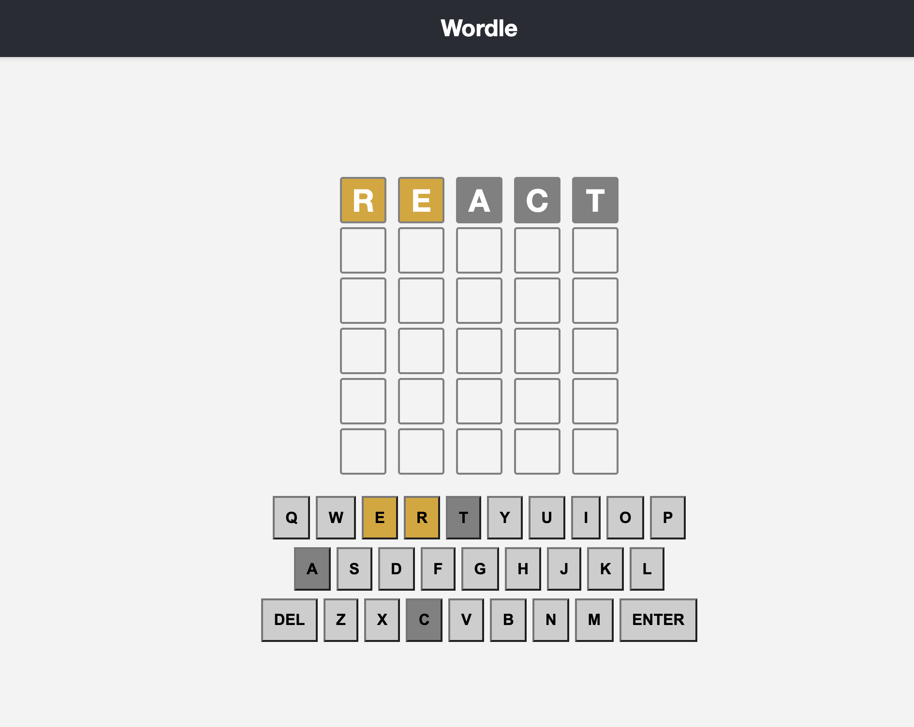
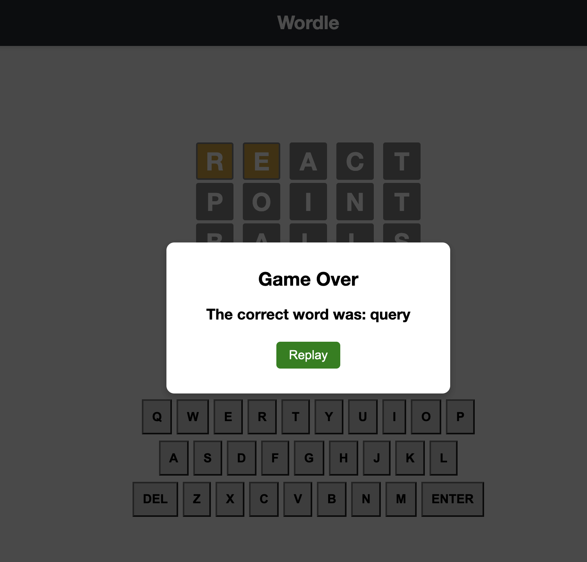

# Wordle Clone

A clone of the classic word puzzle game Wordle, built using React.

## Overview

This project is a clone of the popular word puzzle game Wordle. Players attempt to guess a hidden five-letter word within a certain number of attempts. The game provides feedback on correct and incorrect letters, helping players narrow down their guesses.

## How to Play

1. Clone this repository to your local machine.
2. Navigate to the project directory using your terminal.
3. Install project dependencies by running `npm install`.
4. Start the development server with `npm start`.
5. Open [http://localhost:3000](http://localhost:3000) in your browser to play the game.
6. Guess the hidden word by entering letters into the input boxes and clicking 'Enter'.
7. The game will provide feedback on the correctness of your guess.
8. Continue guessing until you either guess the word correctly or run out of attempts.

### Example Gameplay

Guessing a correct word:

Getting the answer incorrect and seeing the replay menu:

## Available Scripts

In the project directory, you can run:

### `npm start`

Launches the development server and runs the app in development mode. Open [http://localhost:3000](http://localhost:3000) to view it in your browser. The page will reload automatically as you make changes.

### `npm test`

Runs the test suite in interactive watch mode. This helps you ensure the functionality of the game is intact.

### `npm run build`

Builds the production version of the app. It optimizes the build for better performance and prepares it for deployment.

## Customizing the Game

You can customize aspects of the game by modifying the codebase. The main components to consider are the game logic in `App.js`, the keyboard component in `Keyboard.js`, and the game board in `Board.js`.

## Contributing

Contributions are welcome! If you find any issues or have ideas for improvements, feel free to submit pull requests or open issues in this repository.

## Acknowledgments

This project was inspired by the classic game Wordle. It was bootstrapped with [Create React App](https://github.com/facebook/create-react-app).

## License

This project is licensed under the [MIT License](LICENSE).
